# JamesWare AI Meter

<p align="center">
  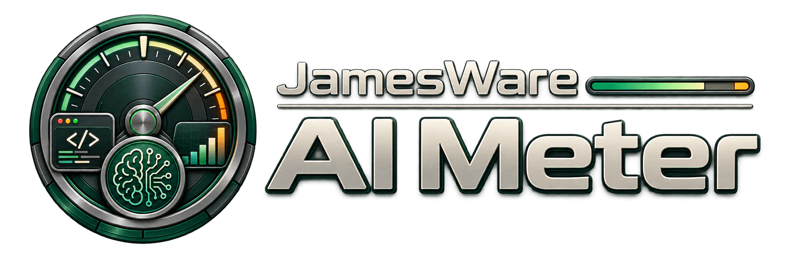
</p>

A local-first usage meter for **Cursor**, **Claude Code**, and **Codex**. Glance at included pools, rolling windows, spend, and on-demand without opening each dashboard.

- **macOS** menu bar extra + desktop widgets (no Dock icon by default)
- **iPhone** app + Home Screen widgets (Cursor snapshot in this version)
- **Apple Watch** glance + complications (sanitized snapshot only — no tokens)

Current version: **1.0.0** · MIT · [LICENSE](LICENSE)

## Download

Download the latest signed and notarized Mac build from [GitHub Releases](https://github.com/JewhurstEngineering/ai-meter/releases/latest/download/AIMeter-1.0.0.zip).

1. Unzip and open **AI Meter**.
2. Click **Install to Applications** in Settings → About if you launched it from Downloads.
3. Sign in with Cursor, Claude Code, and/or Codex.

AI Meter checks GitHub Releases for signed updates using [Sparkle](https://sparkle-project.org/). Update archives are independently verified before installation.

iPhone and Watch builds stay on TestFlight.

## What it looks like

<p align="center">
  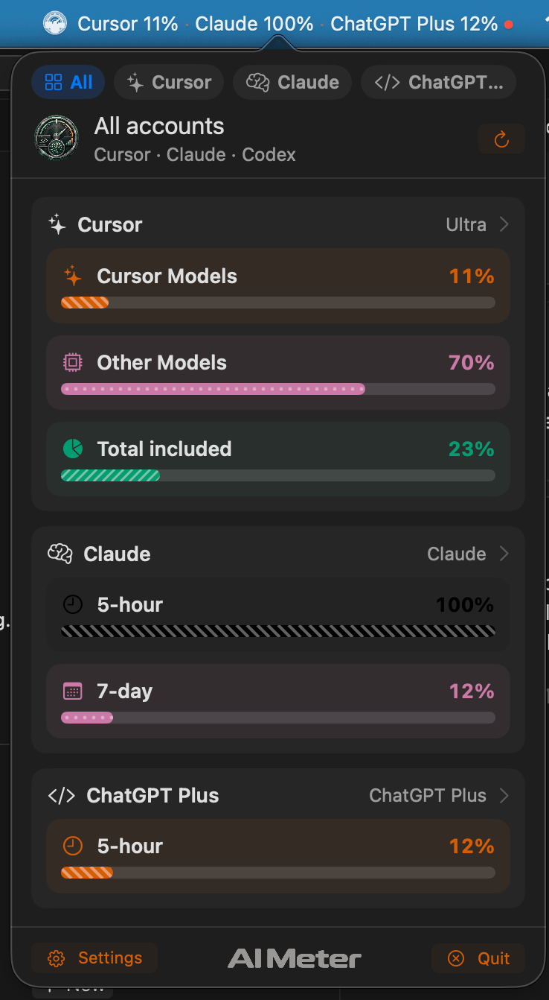
</p>

<p align="center">
  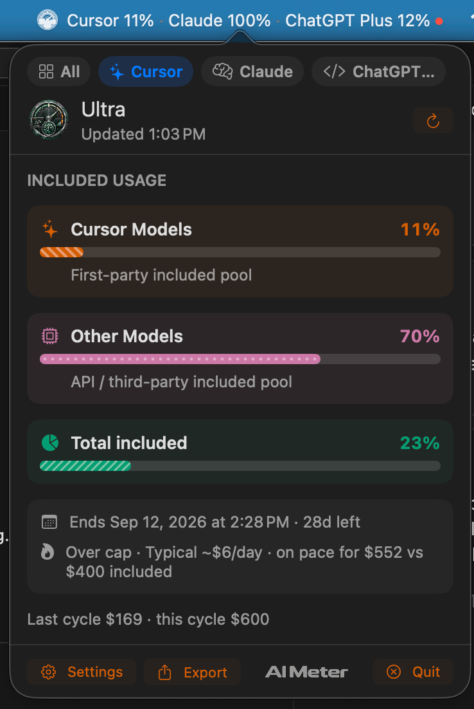
  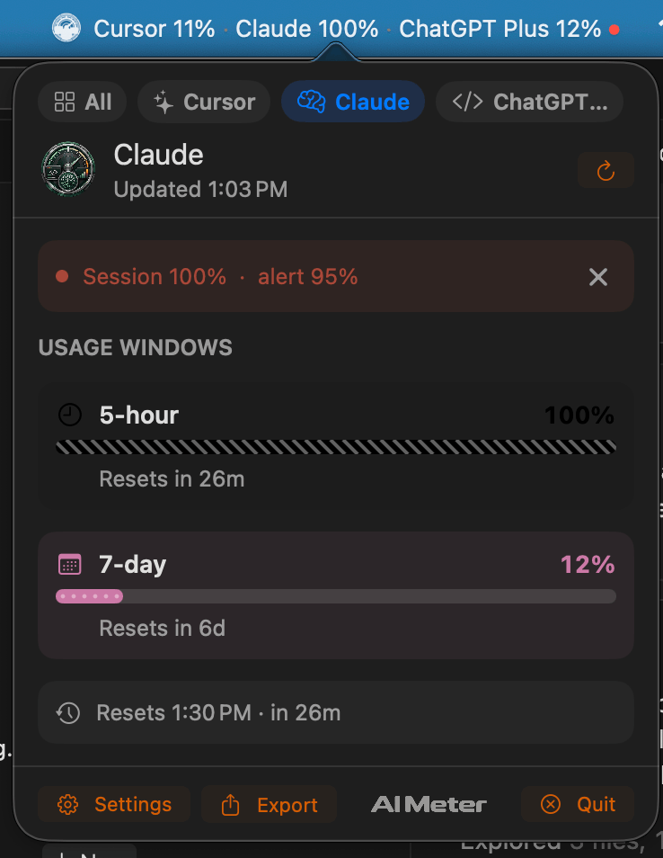
  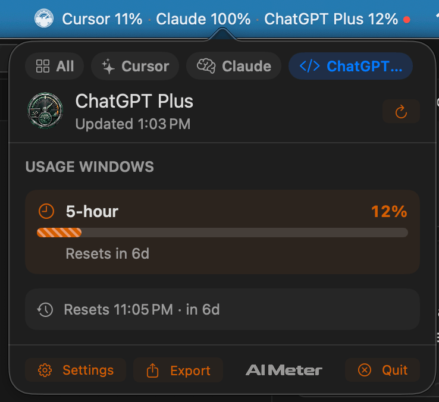
</p>

<p align="center">
  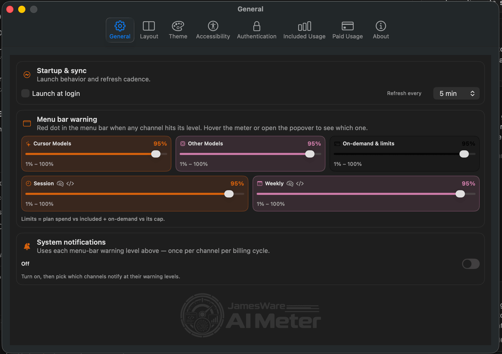
</p>

<p align="center">
  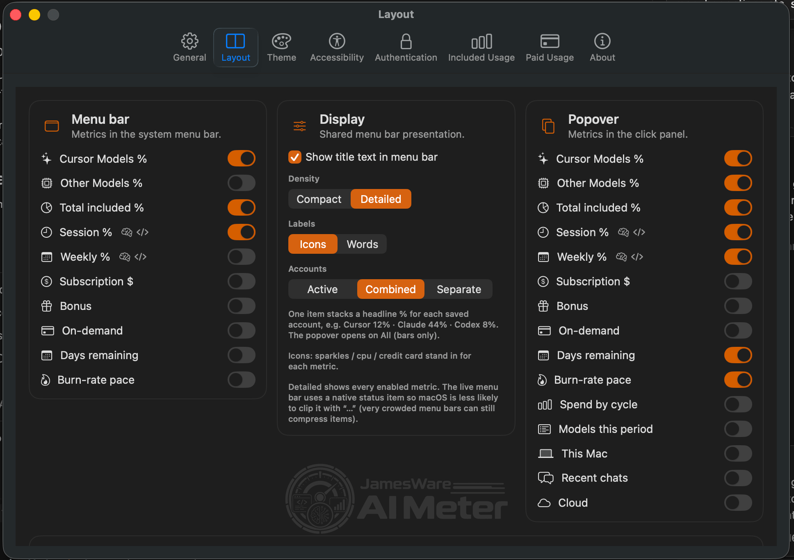
  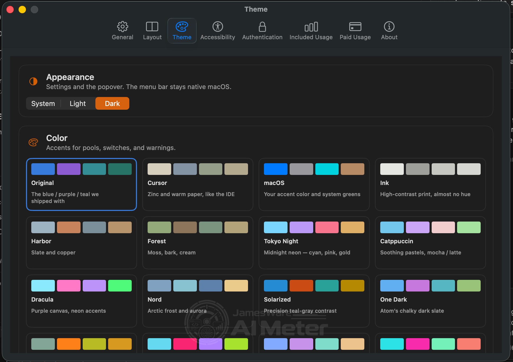
</p>

<p align="center">
  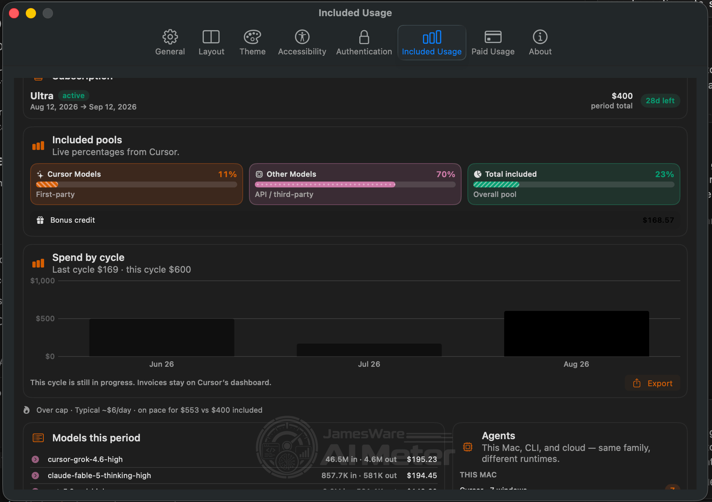
  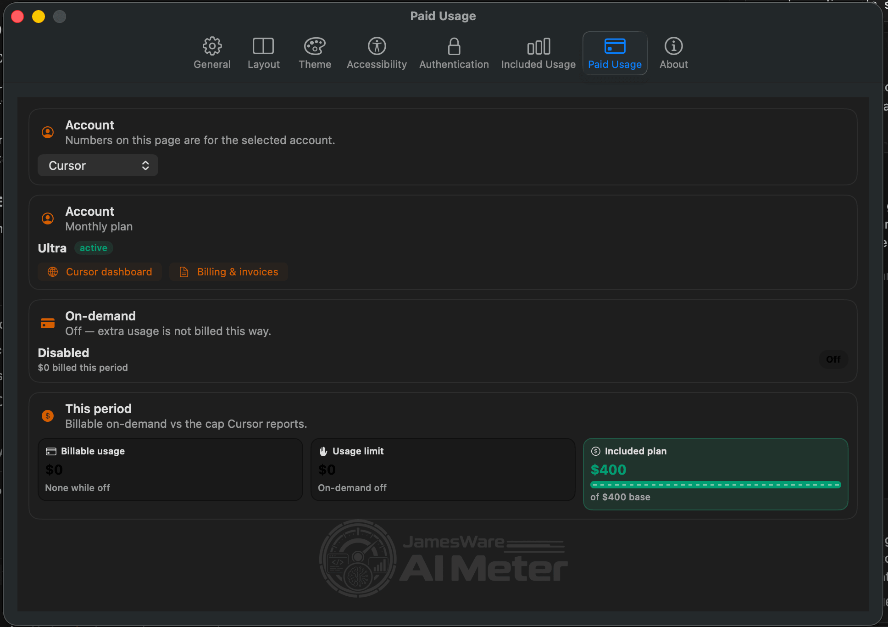
</p>

<p align="center">
  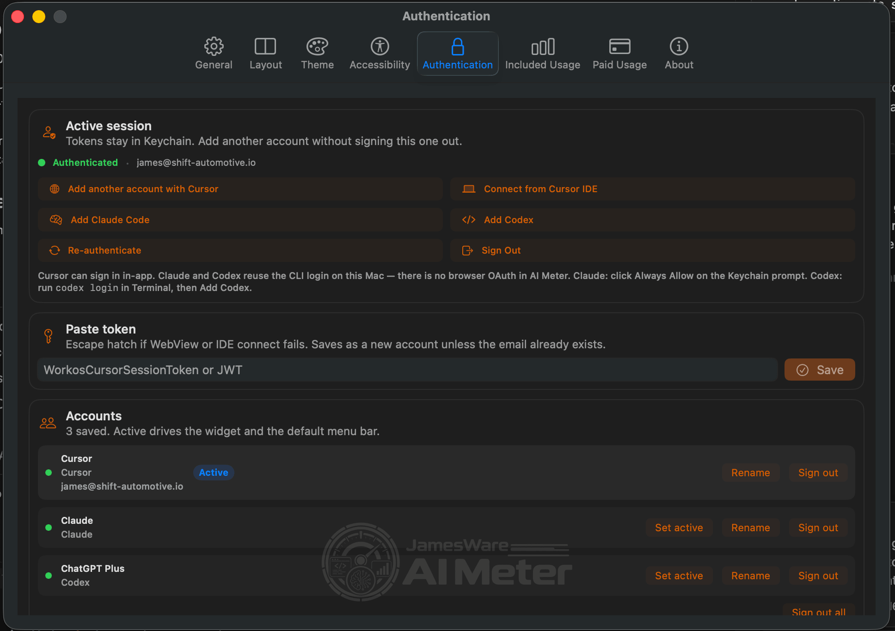
  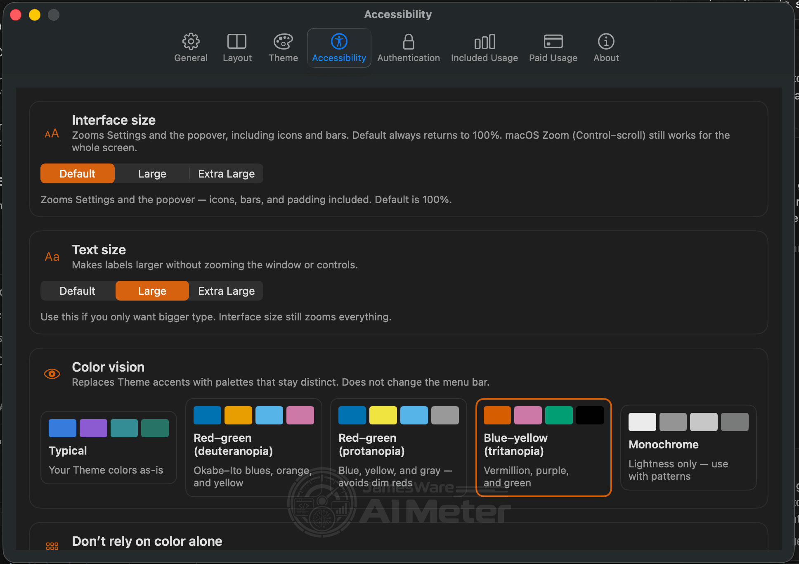
</p>

<p align="center">
  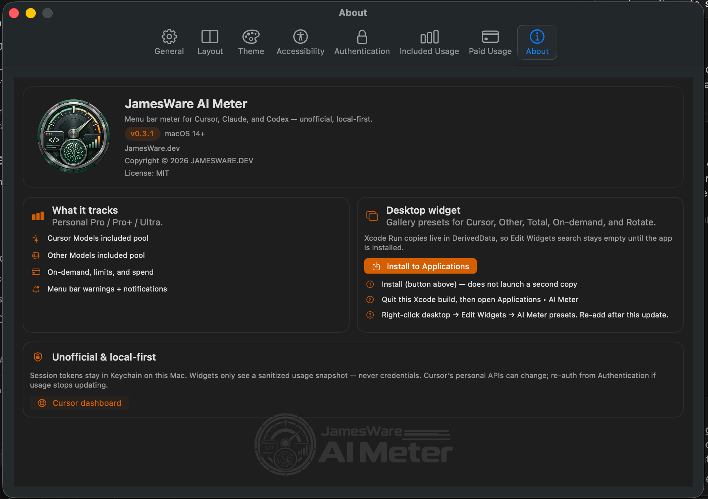
</p>

## What it does

AI Meter signs in with your local sessions, pulls the same usage the products already show, and keeps a live snapshot on this device.

| You see | Cursor | Claude / Codex |
|---------|--------|----------------|
| **Cursor / Other / Total %** | Included pools this billing period | — |
| **Session / Weekly %** | — | 5-hour and 7-day rolling windows |
| **Subscription $ / on-demand** | Plan spend vs included + on-demand | Extra usage or credits when present |
| **Models this period** | Per-model spend and tokens | — |
| **Spend by cycle / pace** | Billing windows | Reset countdown instead |
| **Agents** | This Mac / CLI / Cloud | — |

It does **not** scrape dashboards, store tokens in iCloud, or send credentials to Watch. ChatGPT chat message caps and Team / Enterprise Admin APIs are not implemented.

## Sign in

1. **Sign in with Cursor** — in-app WebView; captures `WorkosCursorSessionToken`
2. **Connect from Cursor IDE** (Mac only) — prefers the IDE `state.vscdb` token, then Agent keychain `cursor-access-token`
3. **Add Claude Code** (Mac only) — Claude Code keychain or `~/.claude/.credentials.json`
4. **Add Codex** (Mac only) — `~/.codex/auth.json`
5. **Paste token** — Cursor JWT or full cookie value

Tokens stay in the device Keychain. You can save multiple accounts (mixed providers), rename them, and show them **Active**, **Combined**, or **Separate** in the menu bar.

## Build from source

Requirements: Xcode 16+, macOS 14+, and your own Apple Development signing team.

```bash
git clone https://github.com/JewhurstEngineering/ai-meter.git
cd ai-meter
brew install xcodegen   # if needed
xcodegen generate
open AIMeter.xcodeproj
```

- Scheme **AIMeter** → My Mac (look in the menu bar, not the Dock)
- Scheme **AIMeteriOS** → iPhone (Watch installs as the companion)

```bash
cd Packages/AIMeterCore && swift test
```

Maintainers can regenerate the Xcode project from [`project.yml`](project.yml). The Release pipeline signs, notarizes, staples, and writes a Sparkle appcast:

```bash
./Scripts/release.sh Release
```

That needs a Developer ID Application certificate, a local `notarytool` profile named `notary`, and the AIMeter Sparkle key in the login keychain. Credentials and private keys are never stored in this repository.

## Notes

- Mac uses Developer ID + notarization. It is not App Sandboxed, so it can read local Cursor / Claude / Codex sessions. That is also why it is not on the Mac App Store.
- iPhone and Watch use TestFlight / App Store Connect.
- Shared logic lives in [`Packages/AIMeterCore`](Packages/AIMeterCore).

## Project status

JamesWare AI Meter is an independent open-source project and is not affiliated with, endorsed by, or sponsored by Anysphere, Cursor, Anthropic, or OpenAI. Cursor, Claude, and Codex are trademarks of their respective owners.

## License

[MIT](LICENSE)
